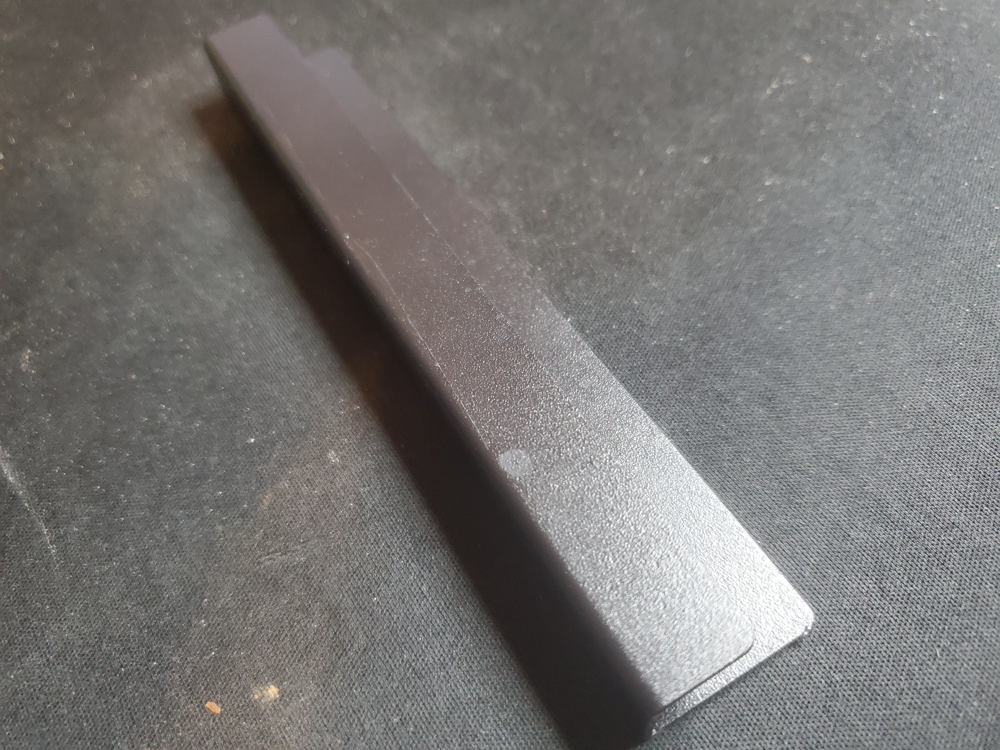
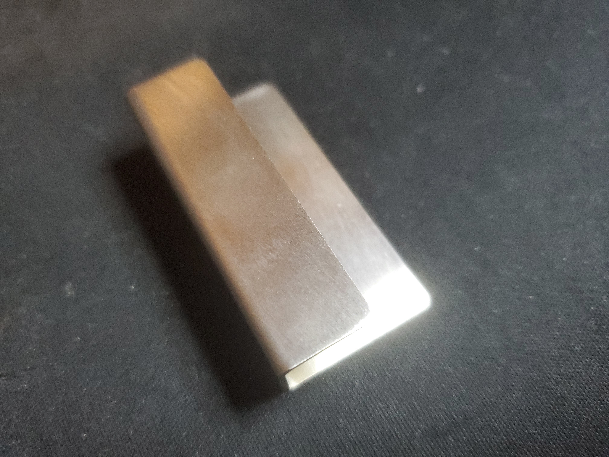
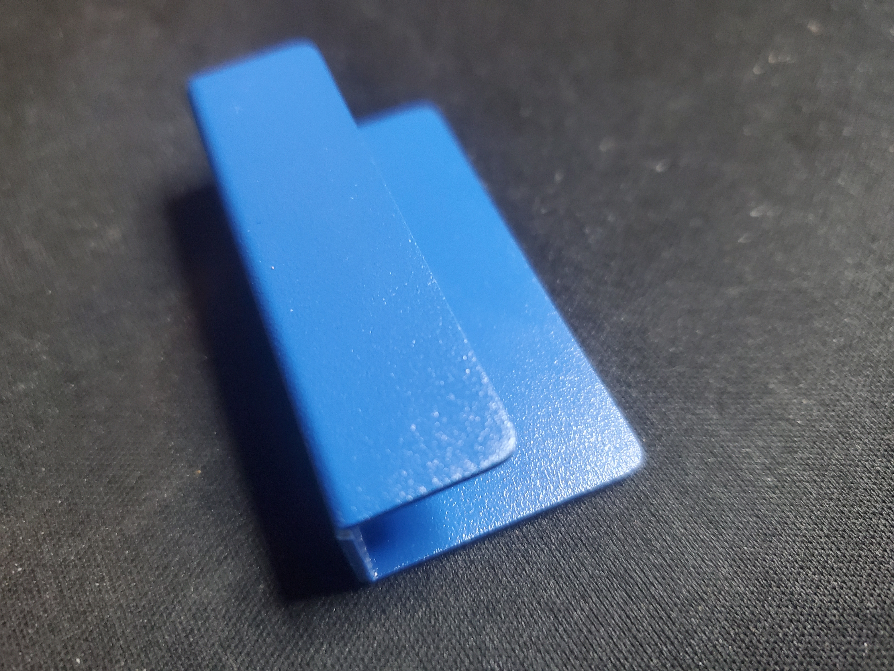
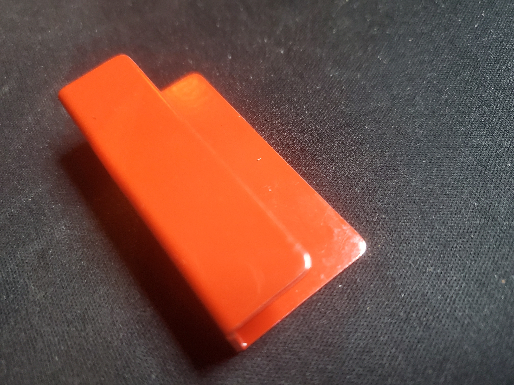
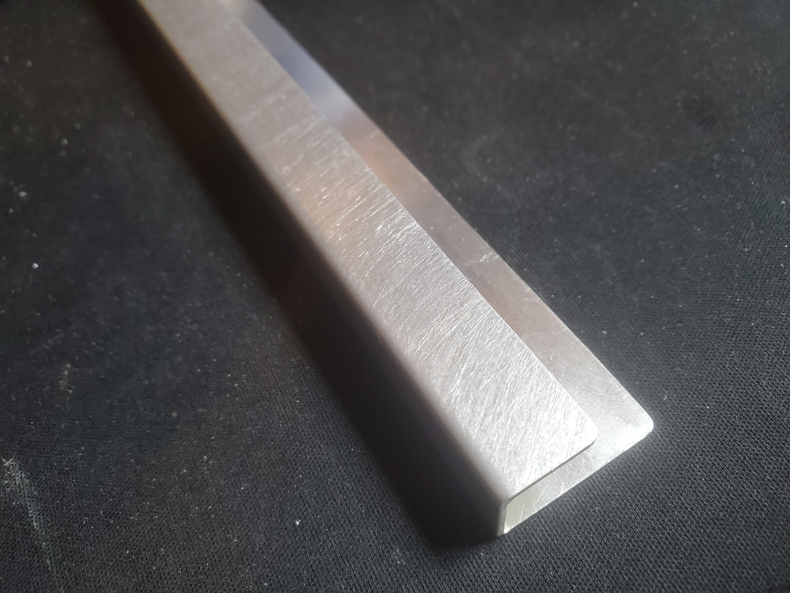

# CD Wall Rack

A wall mounted rack to hold [CD jewel cases](https://en.wikipedia.org/wiki/Optical_disc_packaging).

This design is done in [FreeCAD](https://www.freecad.org/) primarily using the [Sheet Metal Workbench](https://wiki.freecad.org/SheetMetal_Workbench). This is my first attempt at using FreeCAD and mostly done as a learning exercise.

There are 3 versions of the design so far; the only difference between them is the length of the rail (and therefore the number of CDs they can hold):

A designs are intended to be folded from 1mm thick sheet metal.

## Example builds

The following examples were made by JLC in February/March 2026.

| File                           | Material            | Finish                  | Photo                                                                                                |
|--------------------------------|---------------------|-------------------------|------------------------------------------------------------------------------------------------------|
| `cd-wall-rack-Single.step`     | 5052 aluminium      | Powder coat black matte |     |
| `cd-wall-rack-SingleMini.step` | 304 stainless steel | None                    |                   |
| `cd-wall-rack-SingleMini.step` | 5052 aluminium      | Powder coat blue matte  |  |
| `cd-wall-rack-SingleMini.step` | 5052 aluminium      | Powder coat red glossy  |  |
| `cd-wall-rack-Triple.step`     | 5052 aluminium      | None                    |                             |

## Similar projects

* [CD Wall (with pegs)](https://github.com/PhilboBaggins/cd-wall-with-pegs)
* [CD Wall (laser cut)](https://github.com/PhilboBaggins/cd-wall-laser-cut)
